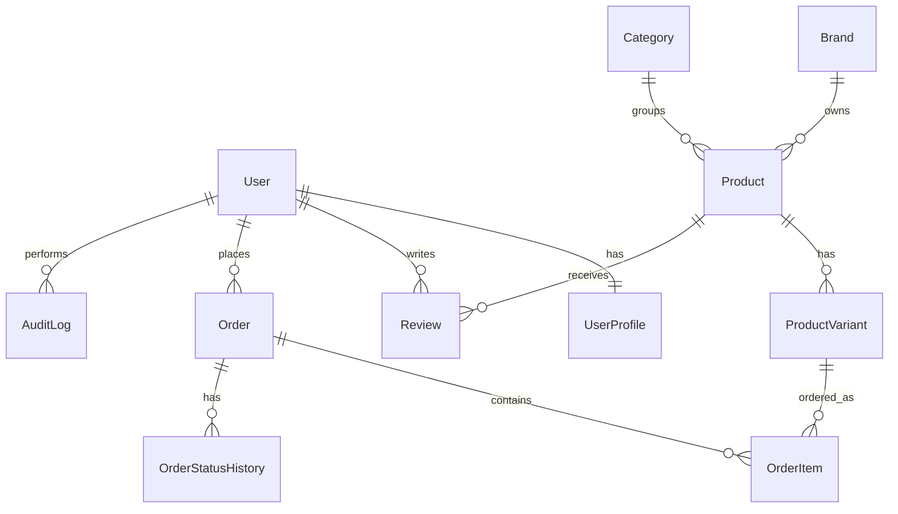

# ERD — Clothing Store

## Cel modelu danych

Model danych opisuje sklep odzieżowy obsługujący katalog produktów, warianty produktów, koszyk sesyjny, zamówienia, płatność BLIK, kupony rabatowe, opinie, role użytkowników, historię statusów oraz AuditLog.

## Encje

| Encja | Opis |
|---|---|
| User | Konto użytkownika Django |
| UserProfile | Profil użytkownika, rola i dane adresowe |
| Brand | Marka produktu |
| Category | Kategoria produktu |
| Product | Produkt bazowy |
| ProductVariant | Wariant produktu: rozmiar, kolor, cena, stan |
| Review | Opinia użytkownika o produkcie |
| Coupon | Kupon rabatowy |
| Order | Zamówienie |
| OrderItem | Pozycja zamówienia |
| OrderStatusHistory | Historia zmian statusu zamówienia |
| AuditLog | Audyt operacji systemowych |

## Relacje biznesowe

| Relacja | Kardynalność | Opis |
|---|---:|---|
| User — UserProfile | 1..1 | Użytkownik posiada jeden profil |
| Brand — Product | 1..* | Marka posiada wiele produktów |
| Category — Product | 1..* | Kategoria grupuje wiele produktów |
| Product — ProductVariant | 1..* | Produkt ma wiele wariantów |
| Product — Review | 1..* | Produkt może mieć wiele opinii |
| User — Review | 1..* | Użytkownik może wystawić wiele opinii |
| User — Order | 1..* | Użytkownik może złożyć wiele zamówień |
| Order — OrderItem | 1..* | Zamówienie ma wiele pozycji |
| ProductVariant — OrderItem | 1..* | Wariant może wystąpić w wielu zamówieniach |
| Order — OrderStatusHistory | 1..* | Zamówienie ma historię statusów |
| User — AuditLog | 0..* | Użytkownik może wykonywać akcje audytowane |

## Diagram ERD

## Najważniejsze atrybuty

### UserProfile

| Pole | Znaczenie |
|---|---|
| user | Powiązanie z kontem użytkownika |
| role | Rola biznesowa: CUSTOMER, WAREHOUSE, MANAGER, ADMIN |
| phone | Telefon kontaktowy |
| street | Ulica dostawy |
| postal_code | Kod pocztowy |
| city | Miasto |

### Product

| Pole | Znaczenie |
|---|---|
| brand | Marka |
| category | Kategoria |
| name | Nazwa produktu |
| gender | Grupa docelowa |
| material | Materiał |
| image | Zdjęcie produktu |
| is_featured | Czy produkt jest promowany |

### ProductVariant

| Pole | Znaczenie |
|---|---|
| product | Produkt bazowy |
| size | Rozmiar |
| color | Kolor |
| sku | Unikalny kod wariantu |
| price | Cena bazowa |
| sale_price | Cena promocyjna |
| stock | Stan magazynowy |

### Order

| Pole | Znaczenie |
|---|---|
| order_number | Numer zamówienia, np. ORD-2026-000001 |
| user | Klient |
| status | Status: NEW, PAID, SHIPPED, DELIVERED |
| tracking_number | Numer przesyłki |
| coupon_code | Zastosowany kupon |
| total_before_discount | Wartość przed rabatem |
| discount_amount | Kwota rabatu |
| total_after_discount | Wartość po rabacie |
| first_name / last_name / phone / street / postal_code / city | Snapshot danych dostawy |

## Uwagi projektowe

- Dane adresowe są kopiowane do zamówienia jako snapshot.
- Koszyk jest przechowywany w sesji, więc nie występuje jako osobna tabela.
- Historia statusów zamówienia jest zapisywana w `OrderStatusHistory`.
- Operacje biznesowe są dodatkowo zapisywane w `AuditLog`.
