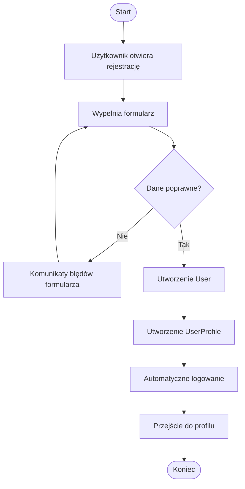
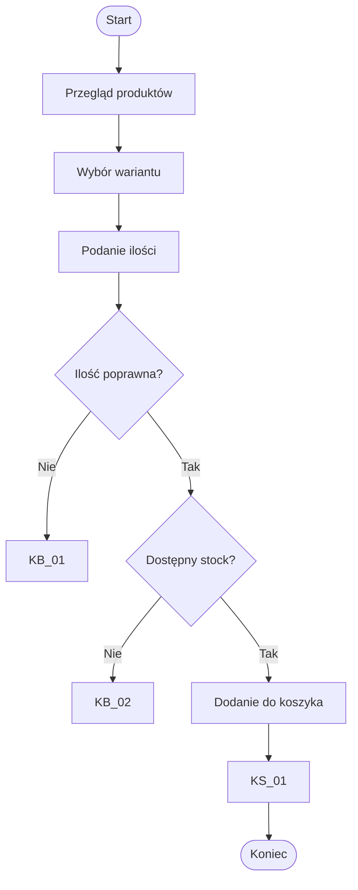
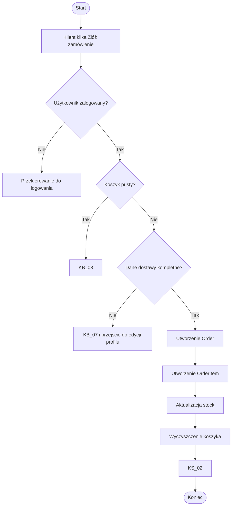
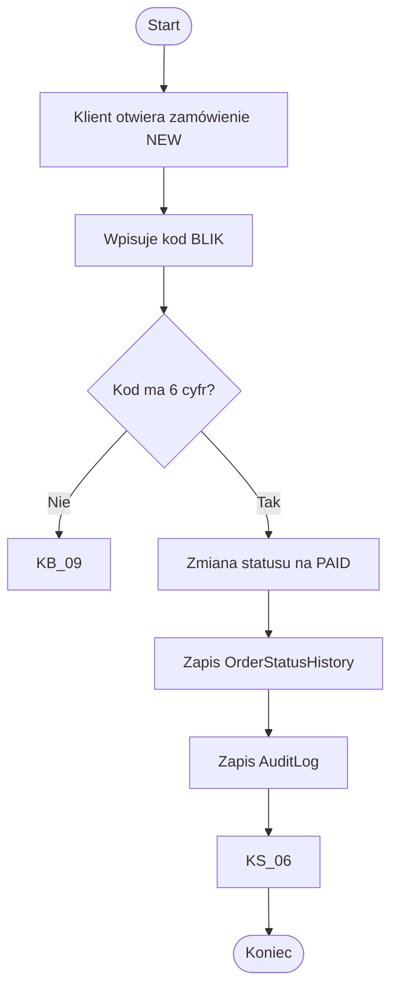
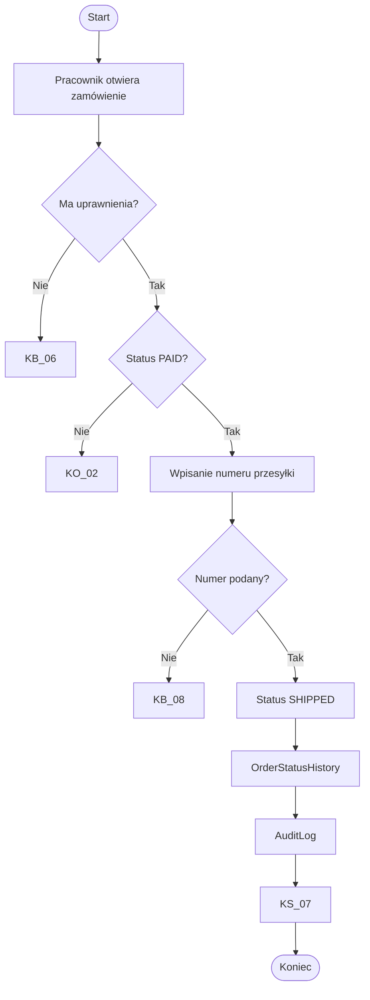
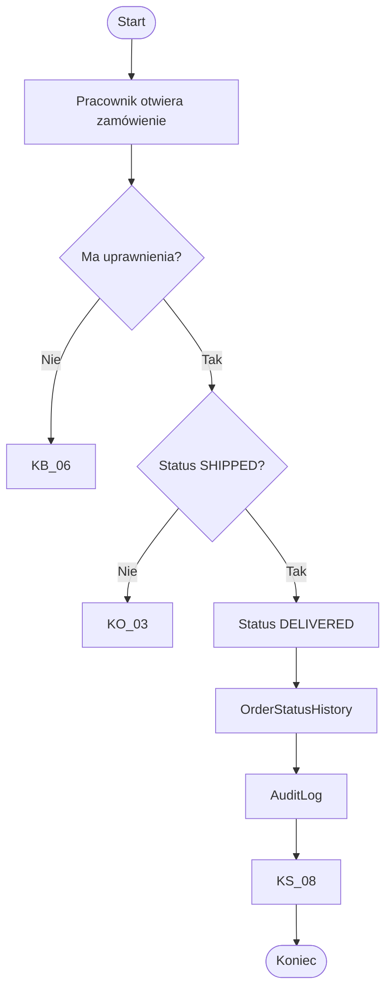
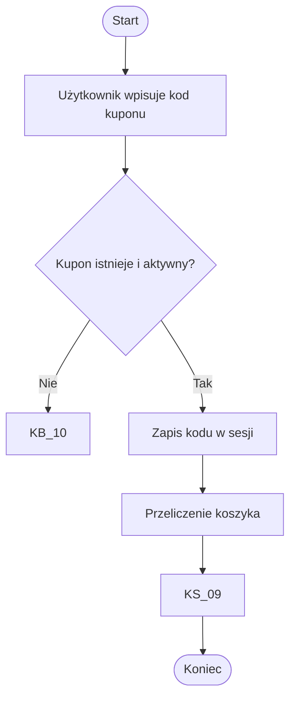
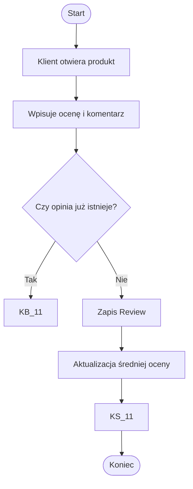

# BPMN / Procesy biznesowe — Clothing Store

## BP-01 Rejestracja użytkownika

## BP-02 Zakup produktu

## BP-03 Checkout

## BP-04 Płatność Fake BLIK

## BP-05 Wysyłka zamówienia

## BP-06 Dostarczenie zamówienia

## BP-07 Obsługa kuponu

## BP-08 Dodanie opinii

