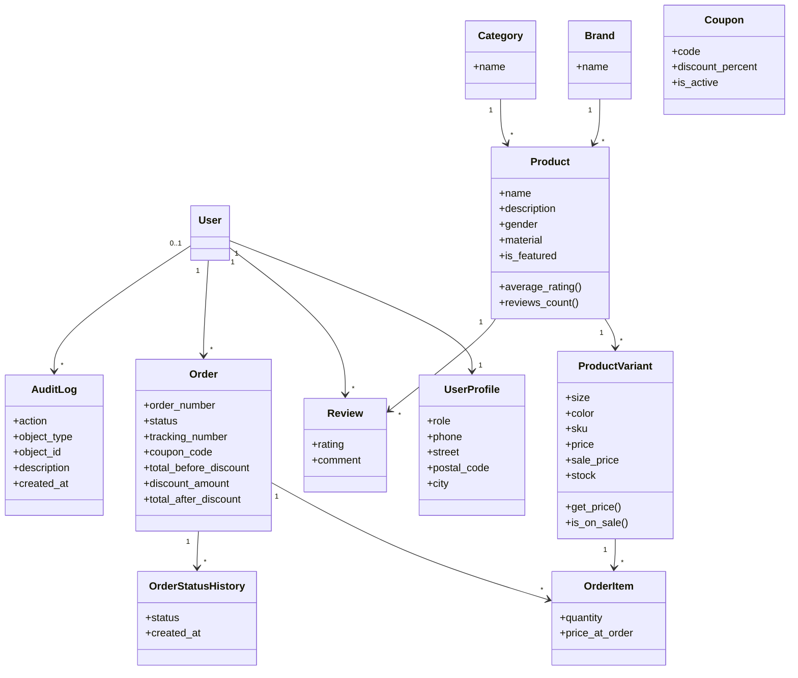

# Diagram klas UML — Clothing Store

## Cel

Diagram klas przedstawia strukturę obiektową systemu sklepu internetowego oraz relacje pomiędzy klasami domenowymi.

## Główne klasy domenowe

### User

Odpowiada za uwierzytelnienie użytkownika.

### UserProfile

Przechowuje dane biznesowe użytkownika:

- rola
- telefon
- adres dostawy

### Brand

Reprezentuje markę produktu.

### Category

Reprezentuje kategorię produktu.

### Product

Produkt biznesowy.

Przykład:

- Nike Air Max
- Adidas Superstar

### ProductVariant

Konkretny wariant produktu.

Przykład:

- Nike Air Max
- rozmiar: 42
- kolor: czarny

### Coupon

Kod rabatowy.

### Review

Ocena produktu.

Zakres:

- 1 gwiazdka
- 5 gwiazdek

### Order

Reprezentuje zamówienie klienta.

Statusy:

- NEW
- PAID
- SHIPPED
- DELIVERED

### OrderItem

Pozycja zamówienia.

### OrderStatusHistory

Historia zmian statusów.

### AuditLog

Historia operacji wykonywanych w systemie.

---

## Diagram UML

## Relacje UML

### Asocjacje

| Klasa A | Klasa B | Typ |
|----------|----------|------|
| User | UserProfile | 1:1 |
| Brand | Product | 1:* |
| Category | Product | 1:* |
| Product | ProductVariant | 1:* |
| Product | Review | 1:* |
| User | Review | 1:* |
| User | Order | 1:* |
| Order | OrderItem | 1:* |
| ProductVariant | OrderItem | 1:* |
| Order | OrderStatusHistory | 1:* |
| User | AuditLog | 0..1:* |

## Najważniejsze reguły projektowe

1. Produkt nie przechowuje stanu magazynowego.
2. Stan magazynowy znajduje się na poziomie wariantu.
3. Zamówienie przechowuje snapshot danych dostawy.
4. Opinia jest unikalna dla pary:
   - użytkownik
   - produkt
5. AuditLog jest niezależny od procesu zamówienia.
6. Historia statusów nie nadpisuje wcześniejszych zmian.
