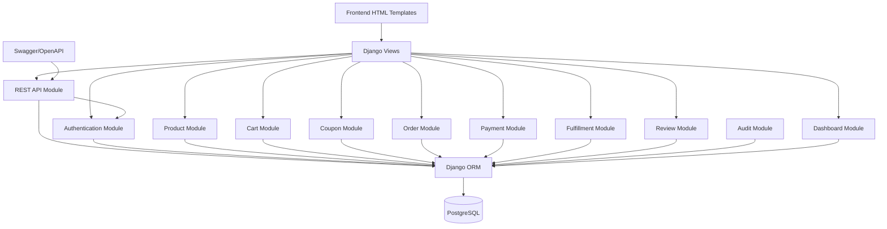

# Diagram komponentów — Clothing Store

## Cel

Diagram komponentów przedstawia logiczną architekturę aplikacji, podział odpowiedzialności pomiędzy modułami oraz sposób komunikacji pomiędzy warstwami systemu.

---

# Architektura warstwowa

```text
Presentation Layer
        ↓
Application Layer
        ↓
Domain Layer
        ↓
Persistence Layer
        ↓
PostgreSQL
```

---

# Komponenty biznesowe

## Frontend

Odpowiada za:

- prezentację danych
- formularze
- komunikaty użytkownika
- obsługę sesji

Technologie:

- Django Templates
- HTML
- CSS

---

## Authentication Module

Odpowiada za:

- rejestrację
- logowanie
- wylogowanie
- JWT
- role użytkowników

Endpointy:

```text
/register/
/login/
/logout/
/api/token/
/api/token/refresh/
```

---

## Product Module

Odpowiada za:

- katalog produktów
- marki
- kategorie
- warianty
- wyszukiwarkę
- filtrowanie

Modele:

```text
Brand
Category
Product
ProductVariant
```

---

## Cart Module

Odpowiada za:

- przechowywanie koszyka
- dodawanie produktów
- usuwanie produktów
- wyliczanie wartości koszyka

Mechanizm:

```text
Session Storage
```

---

## Coupon Module

Odpowiada za:

- walidację kodów rabatowych
- wyliczanie rabatu

Model:

```text
Coupon
```

---

## Order Module

Odpowiada za:

- checkout
- tworzenie zamówień
- historię zamówień
- szczegóły zamówień

Modele:

```text
Order
OrderItem
OrderStatusHistory
```

---

## Payment Module

Aktualna implementacja:

```text
Fake BLIK
```

Odpowiada za:

- walidację kodu BLIK
- zmianę statusu zamówienia

Przejście:

```text
NEW → PAID
```

---

## Fulfillment Module

Odpowiada za:

- wysyłkę zamówień
- numer przesyłki
- dostarczenie

Przejścia:

```text
PAID → SHIPPED
SHIPPED → DELIVERED
```

---

## Review Module

Odpowiada za:

- opinie klientów
- oceny 1–5
- średnią ocen produktu

Model:

```text
Review
```

---

## Audit Module

Odpowiada za:

- historię operacji biznesowych
- śledzenie zmian statusów

Model:

```text
AuditLog
```

---

## Dashboard Module

Odpowiada za:

- statystyki sprzedaży
- top produkty
- top marki
- przychód
- podgląd AuditLog

Dostęp:

```text
MANAGER
ADMIN
staff
```

---

## REST API Module

Udostępnia dane systemowe.

Endpointy:

```text
/api/products/
/api/products/{id}
/api/brands/
/api/categories/
/api/orders/
```

---

## Swagger / OpenAPI Module

Dokumentacja kontraktu API.

Endpointy:

```text
/api/swagger/
/api/redoc/
/api/schema/
```

---

# Diagram komponentów



---

# Architektura techniczna

## Backend

```text
Python 3.12+
Django
Django REST Framework
SimpleJWT
```

## Baza danych

```text
PostgreSQL
```

## Dokumentacja API

```text
drf-spectacular
Swagger
Redoc
```

## Testy

```text
Django Test Framework
APITestCase
```

## Konteneryzacja

```text
Docker
Docker Compose
```

---

# Punkty integracyjne

## UI → Backend

```text
HTTP
```

## REST API → Klienci zewnętrzni

```text
JSON
JWT
```

## Backend → PostgreSQL

```text
Django ORM
SQL
```

---

# Obszary rozwojowe

Planowane rozszerzenia:

```text
Przelewy24
Stripe
Email notifications
GitHub Actions
CI/CD
Eksport XLSX
Wykresy sprzedaży
Nginx + Gunicorn
Kubernetes
```
